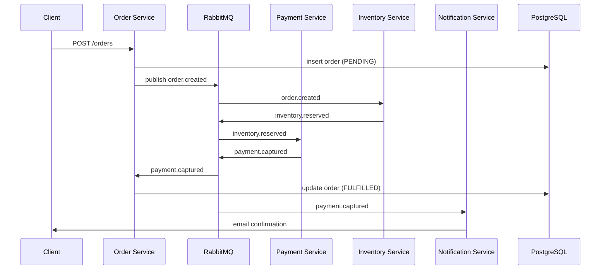

# Event-Driven Order Processing System

A microservices-based order processing backend where every state transition (placed → validated → payment → fulfilled → shipped) is driven by domain events over RabbitMQ, giving full auditability and independent scalability per service.

## Architecture



## How It Works

1. **Order Service** accepts REST requests and publishes `order.created` — it never calls other services directly
2. **Inventory Service** reserves stock and emits `inventory.reserved` (or `inventory.failed` for out-of-stock)
3. **Payment Service** charges the customer and emits `payment.captured` or `payment.failed`
4. **Saga pattern** — if any step fails, compensating events roll back upstream actions (release inventory, void charge)
5. **Outbox pattern** — events are written to a DB outbox table atomically with state changes, then relayed to RabbitMQ — zero chance of lost events

## Tech Stack

| Layer | Technology |
|-------|-----------|
| Message Broker | RabbitMQ (topic exchanges) |
| Services | Node.js + Express |
| Database | PostgreSQL (per-service schemas) |
| Pattern | Saga + Outbox |
| API | REST with OpenAPI spec |
| Observability | Structured JSON logging |

## Project Structure

```
event-driven-order-system/
├── services/
│   ├── order/         # Order lifecycle + REST API
│   ├── inventory/     # Stock reservation
│   ├── payment/       # Charge processing (Stripe mock)
│   └── notification/  # Email / SMS dispatch
├── shared/
│   └── events/        # Shared event schema definitions
├── docker-compose.yml
└── README.md
```

## Key Features

- Saga orchestration for distributed transactions
- Outbox pattern guarantees at-least-once event delivery
- Dead-letter queues for failed message handling
- Each service owns its own database schema (no shared tables)
- Full event audit log — every state transition is recorded
